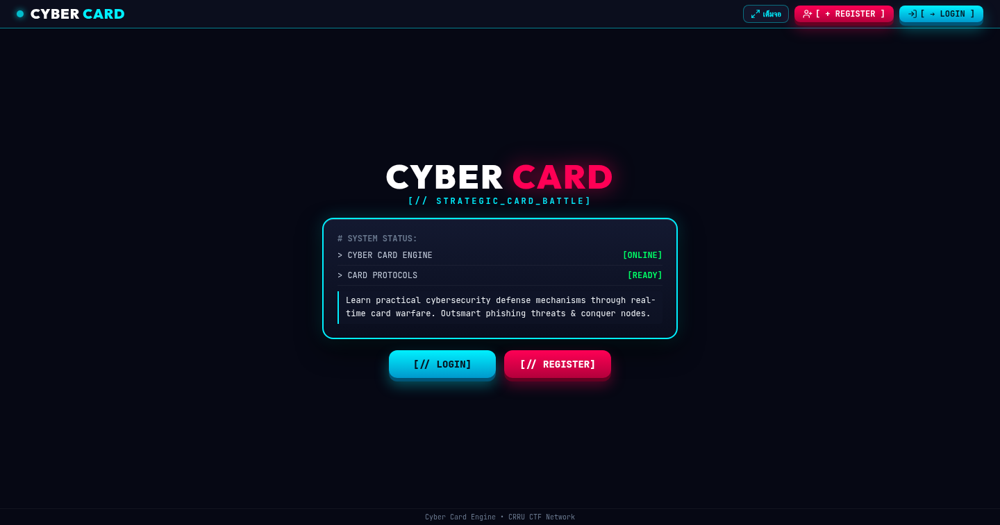
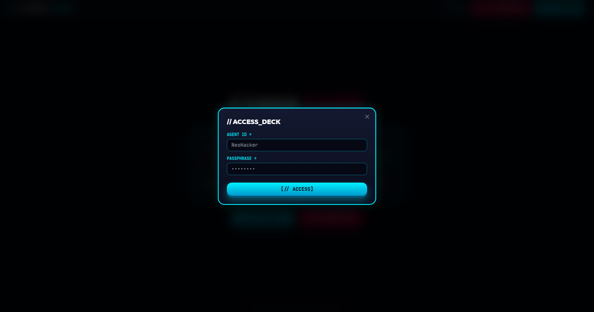
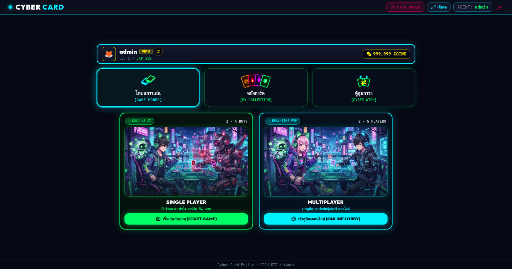
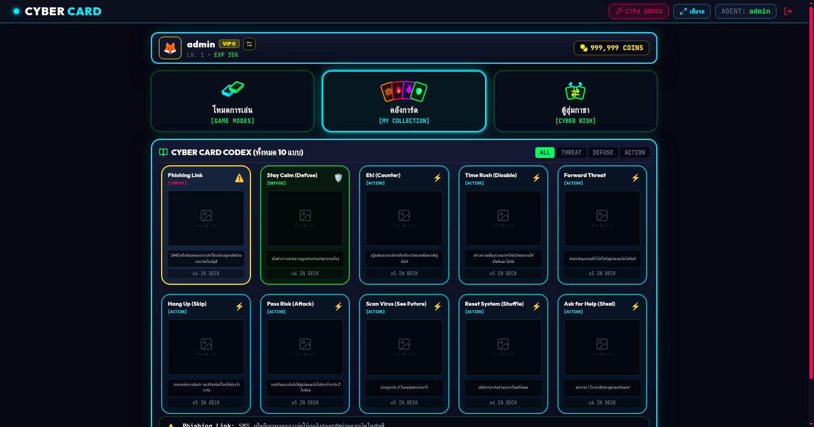
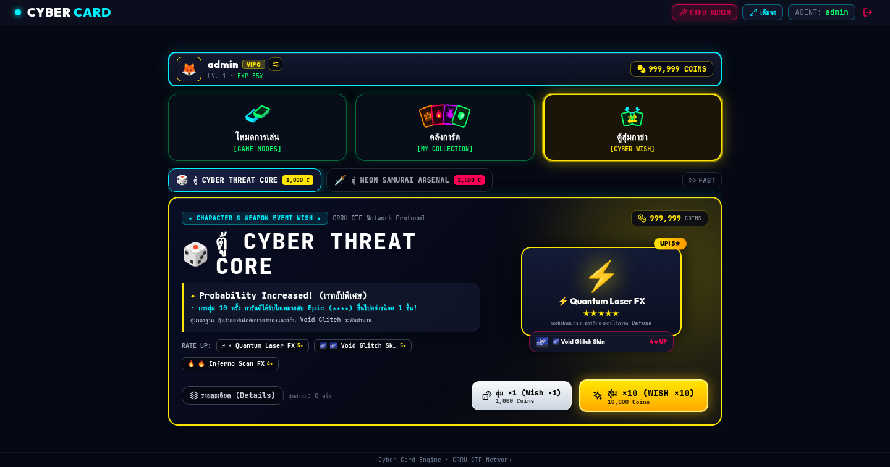
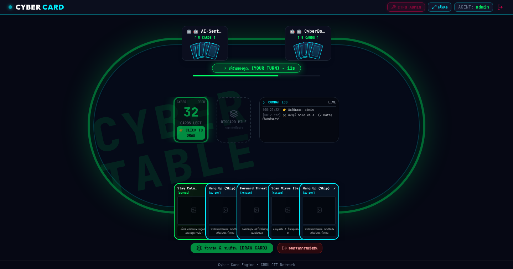

<div align="center">

# 🃏 CRRU Cyber Game Card
### **Cybersecurity Card Battle Game & Gacha System**
*Interactive Cyber Threat Defense & Gacha Deck Builder for CTF Players*

[](https://github.com/bosskitti)
[](https://github.com/bosskitti)
[](https://github.com/bosskitti)

</div>

---

## 📖 เกี่ยวกับโครงการ (About the Project)

**CRRU Cyber Game Card** คือเกมการ์ดประลองยุทธวิธีด้านความมั่นคงปลอดภัยไซเบอร์ (Cybersecurity Card Game) ที่ผสมผสานแนวคิดเกมการ์ดเอาชีวิตรอด (คล้าย Exploding Kittens ในธีม Cyber Threat Defense) พร้อมระบบสุ่มการ์ด (Gacha System), ร้านค้าการ์ด (Card Market), และสมุดสะสมการ์ด (Card Codex) เชื่อมโยงเข้ากับระบบ CTFd

### ✨ ฟีเจอร์เด่น (Key Features)
- **🎮 โหมดการเล่นหลากหลาย (Game Modes):**
  - **Single Player (Vs AI):** ฝึกฝนประลองยุทธวิธีรับมือภัยคุกคามกับบอท
  - **Multiplayer PvP (Real-time Socket.io):** สร้างห้องและร่วมเล่นออนไลน์แบบ Real-time
- **🃏 การ์ดยุทธวิธีไซเบอร์ (Cyber Threat & Defense Cards):**
  - `Phishing Link` (ภัยคุกคาม)
  - `Stay Calm / Defuse` (การป้องกันและแก้ไข)
  - `Eh! / Counter` (การยกเลิกแอ็กชัน)
  - `Scan Virus / See Future` (ตรวจจับภัยคุกคามล่วงหน้า)
  - `Time Rush / Disable`, `Pass Risk / Attack`, `Forward Threat`, `Reset System / Shuffle`
- **🎰 ระบบกาชาและร้านค้า (Gacha & Market):**
  - สุ่มการ์ดพิเศษพร้อมระบบการันตี (Pity System) และเรทโอกาสออกตาม Rarity
  - ระบบกระเป๋าเงินเหรียญ (Coins)
- **🛠️ แผงควบคุมผู้ดูแลระบบ (Admin Panel):**
  - จัดการการ์ดในระบบ (Card Pool Manager)
  - จัดการตู้กาชา (Gacha Banner Manager)
  - จัดการบัญชีผู้เล่น (User Management)

---

## 📸 ภาพตัวอย่างระบบ (Screenshots & Gameplay)

| 1. หน้าแรก (System Interface) | 2. ระบบเข้าสู่ระบบ (Access Deck) |
|:---:|:---:|
|  |  |

| 3. โหมดการเล่น & แดชบอร์ด (Game Modes) | 4. คลังการ์ดยุทธวิธี (Card Codex) |
|:---:|:---:|
|  |  |

| 5. ตู้สุ่มกาชาพรีเมียม (Cyber Wish / Gacha) | 6. สมรภูมิโต๊ะการ์ดไซเบอร์ (Cyber Table Battle) |
|:---:|:---:|
|  |  |

---

## 🏗️ โครงสร้างระบบ (Architecture)

```
Crru_game_card/
├── client/                 # Frontend (React, Vite, Tailwind CSS)
│   ├── src/                # คอมโพเนนต์และ Logic หน้าจอเกม
│   ├── public/             # ไฟล์รูปภาพการ์ด, อวาตาร์, แบนเนอร์
│   └── Dockerfile          # Docker container สำหรับฝั่ง Client
├── server/                 # Backend (Node.js, Express, Socket.io, SQLite)
│   ├── auth.js             # ระบบยืนยันตัวตนและการจัดการเซสชัน
│   ├── db.js               # การเชื่อมต่อ SQLite และ Data Models
│   ├── index.js            # Socket.io Game Engine & Handlers
│   ├── data/               # ข้อมูลตู้กาชา และ Card Pool
│   └── Dockerfile          # Docker container สำหรับฝั่ง Server
├── docker-compose.yml      # Orchestration สำหรับรันทั้งระบบ
└── frpc.ini.example        # ตัวอย่างการตั้งค่า Reverse Proxy (FRP)
```

---

## 🚀 วิธีการติดตั้งและรันระบบ (Getting Started)

### 1. ติดตั้งผ่าน Docker Compose (แนะนำ)

```bash
# 1. คัดลอกไฟล์การตั้งค่าตัวอย่าง
cp .env.example .env
cp frpc.ini.example frpc.ini

# 2. ปรับแต่งค่าความปลอดภัยใน .env และ frpc.ini ตามความเหมาะสม
# (ตั้งค่ารหัสผ่าน ADMIN_PASSWORD ให้ปลอดภัย)

# 3. สั่งรันระบบผ่าน Docker Compose
docker compose up -d --build
```

- Client จะเปิดให้บริการที่พอร์ต `3000` (หรือ `5173`)
- Server Socket.io จะเปิดให้บริการที่พอร์ต `3001`

---

## 🔒 มาตรการความปลอดภัย (Security Guidelines)
- ระบบได้ถูกตัดข้อมูล Credentials, รหัสผ่านจริง, และ Token ออกจาก Repository
- ฐานข้อมูลผู้ใช้และคุกกี้เซสชันจะถูกเก็บไว้เฉพาะในเครื่อง Local และจะไม่ถูกนำขึ้น Git (ควบคุมผ่าน `.gitignore`)
- การตั้งค่าระดับผู้ดูแลระบบต้องกำหนดผ่าน Environment Variable (`ADMIN_PASSWORD`) เสมอ

---

<div align="center">
  <sub>Developed by <a href="https://github.com/bosskitti">bosskitti</a> • CRRU Cyber Defense Lab</sub>
</div>
